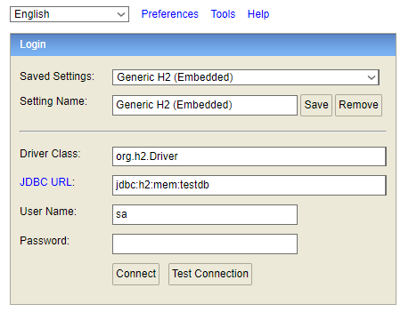
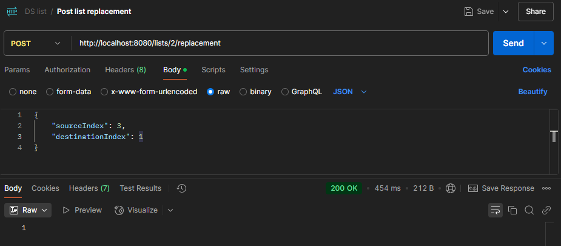

# DSList - Coleção de Jogos


[](https://github.com/spinolagab/projeto-dslist-Java-Spring/blob/main/LICENSE) 


# O projeto

DSList é uma aplicação back-end desenvolvida no decorrer da semana do treinamento gratuito **"Intensivão de Java Spring"**, um evento organizado por Nelio da [DevSuperior](https://devsuperior.com.br). 

A aplicação é uma coleção de jogos que interage com banco de dados usando **PostgreSQL** por meio de um container do **Docker**, os testes com endereços são feitos usando o **Postman**, incluindo o caso de alterar a posição de um elemento na lista. 

A ferramenta que seria utilizada para colocar o projeto na nuvem seria o Railway, no entanto como ele deixou de ter uma opção gratuita essa implementação acabou não sendo possível. Ainda assim, as alterações para que o projeto funcionasse com o Railway foram devidamente feitas e ajustadas segundo instruções.

## Modelo de Domínio


## Tecnologias Utilizadas - Back-end
- Java
- Spring Boot
- Docker
- Postman 

## Banco de dados 
- PostgreSQL

## Como Executar o Projeto
### Pré requisitos
- Java 17+
- Docker
- Postman
- Git

## **1**
- Clone o repositório e faça a seguinte execução
``` bash
git clone https://github.com/spinolagab/projeto-dslist-Java-Spring.git

cd projeto-dslist-Java-Spring

./mvnw spring-boot:run
```

## **2** 
- Crie um container usando o Docker, baixe [esse](https://gist.github.com/acenelio/5e40b27cfc40151e36beec1e27c4ff71) arquivo .yml, coloque-o dentro de uma pasta e execute-o usando o Windows Powershell da seguinte forma: 
``` bash
  docker-compose.yml up -d
```

## **3** 
- Em seu navegador digite localhost:8080/h2-console e faça login da seguinte forma para verificar as tabelas localmente


## **4**
- Acesse o PgAdmin digitando em seu navegador localhost:5050 e faça o login usando o email: me@example.com e a senha: 1234567

## **5**
- Clique com o botão direito do mouse em "Server" e registre o servidor da seguinte forma
  - Nomeie-o de forma que se lembre dele e de sua funcionalidade, nesse caso decidi nomear como Postgres-local-docker
  - Complete o campo Connection da seguinte forma e em Password coloque 1234567
    

## **6**
- Agora você pode fazer as consultas usando o localhost:8080 e as tabelas irão aparecer no banco de dados do localhost:5050, podendo verificar o estado atual do banco de dados em cada momento e podendo até mesmo alterar valores em tempo real.

## **7**
- Usando o Postman verifique o que acontece com as solicitações de endereço e as informações que acabam aparecendo para poderem ser usadas, posteriormente no front-end.
  
  - Mostrar os jogos e seus dados em geral de forma sucinta:
  
  
  - Mostrar o jogo com o ID especificado no endereço e suas informações completas:
  

  - Mostrar as listas de jogos que possuem jogos:
  

  - Mostrar os jogos e seus dados de forma sucinta da lista especificada no endereço:
  

  - Realizar a troca da posição de um jogo em uma lista com um outro jogo:
  
    - Ao realizar uma alteração como essa você deve recarregar a página do PGAdmin e novamente ver a tabela.
    - Para acompanhar as alterações de uma melhor forma use esse código SQL no localhost:8080
    ```SQL
    SELECT TB_BELONGING .*, TB_GAME.TITLE FROM TB_BELONGING
    INNER JOIN TB_GAME ON TB_GAME.ID = TB_BELONGING.GAME_ID
    ## troque o valor do ID abaixo de acordo com a lista que você alterou o posicionamento
    WHERE LIST_ID = 2
    ORDER BY POSITION
    ```

# Autor
Gabriel Alves de Freitas Spinola Sucupira

[](https://www.linkedin.com/in/gabriel-spinola-a19470275/)

Emails:
\
spinolagab@gmail.com
\
gabriel.spinola.profissional@gmail.com
\
10418133@mackenzista.com.br

## Agradecimentos
- Gostaria de agradecer toda a equipe do [DevSuperior](https://devsuperior.com.br) por todo o suporte com dúvidas e dificuldades ao longo do intensivão.